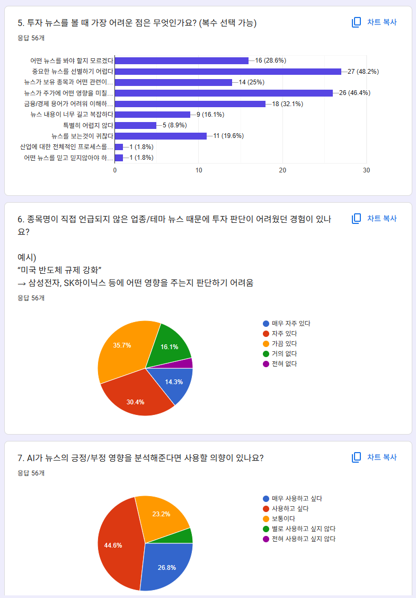
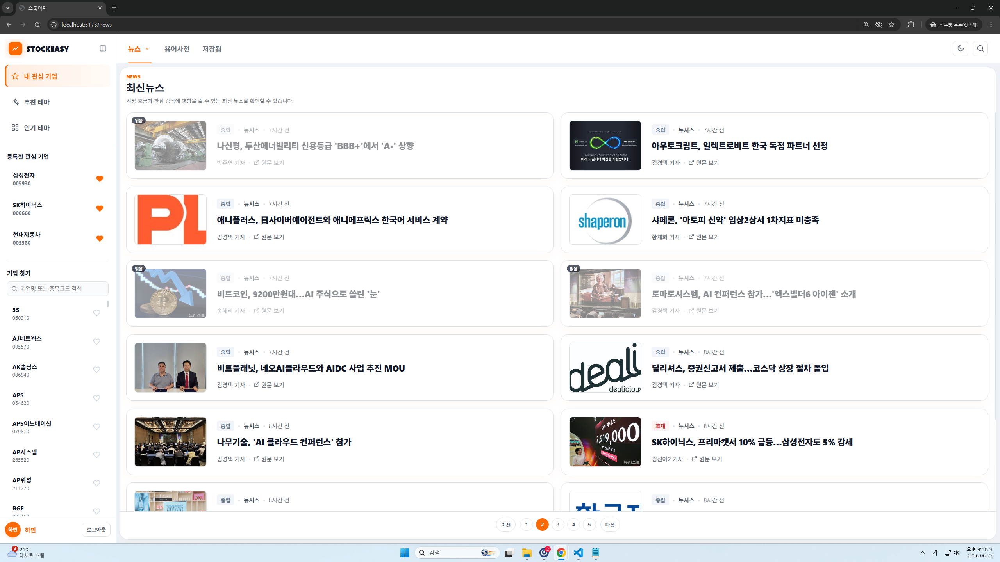
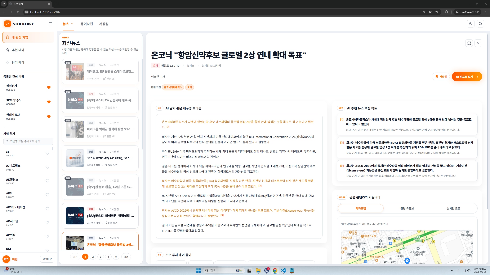
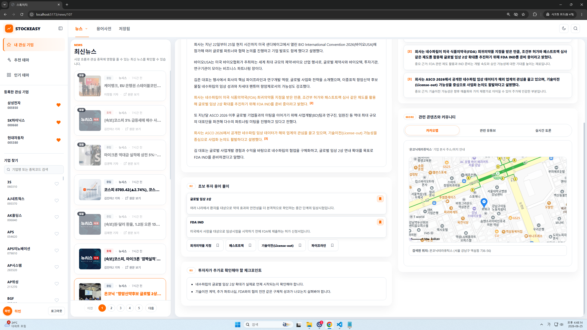
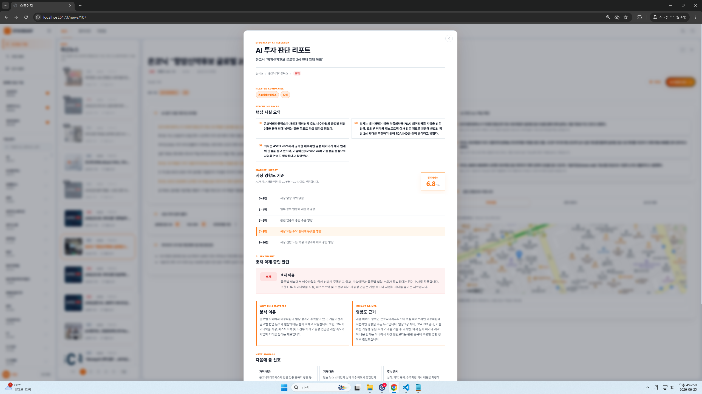

# STOCKEASY

## 1. 프로젝트 소개


**STOCKEASY**은 AI를 활용하여 경제 뉴스를 분석하고, 투자자가 복잡한 뉴스의 핵심 내용을 빠르게 이해하여 투자 판단에 활용할 수 있도록 지원하는 서비스입니다.

본 프로젝트는 이러한 문제를 해결하기 위해 AI 기반 뉴스 분석 기능을 제공하여 투자자가 핵심 정보만 빠르게 파악하고 보다 효율적인 투자 의사결정을 내릴 수 있도록 하는 것을 목표로 합니다.

---

## 문제 정의

투자자는 경제 뉴스를 활용하는 과정에서 다음과 같은 어려움을 겪습니다.

- 하루에도 수백 건의 뉴스가 발생하여 어떤 뉴스를 읽어야 하는지 판단하기 어렵다.
- 경제·금융 용어가 많아 뉴스 내용을 이해하기 어렵다.
- 뉴스가 보유 종목에 긍정적인지 부정적인지 판단하기 어렵다.
- 종목명이 직접 언급되지 않은 산업 및 테마 관련 뉴스를 놓치기 쉽다.
- 단순한 주가 등락만으로는 뉴스의 의미와 시장 영향을 파악하기 어렵다.

### 사용자 설문조사

프로젝트 기획 단계에서 **56명**을 대상으로 설문조사를 진행하였습니다.




**주요 결과**

- 48.2%가 중요한 뉴스를 선별하기 어렵다고 응답
- 46.4%가 뉴스가 주가에 미치는 영향을 판단하기 어렵다고 응답
- 32.1%가 경제·금융 용어 이해에 어려움을 겪는다고 응답
- 71.4%가 AI 기반 뉴스 분석 서비스를 사용할 의향이 있다고 응답
---

## 서비스 목표

AI를 활용하여 투자자가 뉴스 한 건만으로도 핵심 내용을 빠르게 이해하고 투자 판단에 필요한 정보를 확인할 수 있는 서비스를 제공합니다.

## 2. 주요 기능

- 메인화면


- AI 기반 뉴스 요약


- 경제·금융 용어 설명


- AI 투자 판단 리포트 제공


- 뉴스와 연관된 종목 및 테마 제공
- 뉴스에 대한 사용자 댓글 기능
- 관심 종목 관리 기능

---


## 3. 기술 스택
- Backend: Django, DRF
- AI Server: FastAPI
- Frontend: Vue
- DB: SQLite
- AI: OpenAI API

## 4. 시스템 아키텍처
### 아키텍처 구성

- **Vue.js**
  - 뉴스 조회 및 사용자 인터페이스 제공
  - Django REST API를 통해 데이터 조회 및 사용자 요청 처리

- **Django (Backend Server)**
  - 뉴스, 종목, 댓글, 관심 종목 등 서비스의 핵심 비즈니스 로직 담당
  - FastAPI AI 서버와 통신하여 뉴스 분석 요청
  - AI 분석 결과를 데이터베이스에 저장하여 재사용

- **FastAPI (AI Server)**
  - OpenAI API와 연동하여 뉴스 분석 수행
  - 뉴스 요약, 핵심 키워드, 용어 설명, 투자 판단 리포트 생성
  - Django와 분리하여 AI 모델 교체 및 확장성을 고려

- **OpenAI API**
  - LLM 기반 뉴스 분석 수행
  - JSON 형식의 분석 결과 반환

- **SQLite**
  - 뉴스, AI 분석 결과, 댓글, 사용자 정보 등을 저장
  - AI 분석 결과를 캐싱하여 동일 뉴스의 중복 분석 비용 절감

---

### 데이터 처리 흐름

1. 사용자가 뉴스를 선택합니다.
2. Django가 뉴스 데이터를 조회합니다.
3. AI 분석 결과가 존재하는 경우 데이터베이스에서 바로 반환합니다.
4. 분석 결과가 없는 경우 Django가 FastAPI 서버에 분석을 요청합니다.
5. FastAPI가 OpenAI API를 호출하여 뉴스를 분석합니다.
6. 분석 결과를 Django가 데이터베이스에 저장합니다.
7. 저장된 AI 분석 결과를 사용자에게 반환합니다.

---

### AI 서버를 분리한 이유

- AI 모델과 서비스 로직을 분리하여 유지보수성을 향상
- 추후 다른 LLM(Gemini, Claude 등)으로 교체가 용이
- AI 기능을 별도의 서버에서 독립적으로 운영 가능
- 향후 Celery 및 Redis를 이용한 비동기 분석 구조로 확장 가능


## 5. 프로젝트 구조

```text
stock-easy-django/
├── accounts/        
├── analyses/        
├── comments/       
├── config/          
├── fastapi-ai/      
├── news/             
├── stocks/          
├── terms/            
├── manage.py
├── requirements.txt
└── README.md
```

### 디렉터리 설명

| 디렉터리 | 역할 |
|----------|------|
| `accounts` | 회원가입, 로그인 및 사용자 관리 |
| `news` | RSS 뉴스 수집 및 뉴스 조회 |
| `analyses` | FastAPI와 연동하여 AI 뉴스 분석 수행 |
| `stocks` | 종목, 테마, 관심 종목 관리 |
| `terms` | 경제 용어 및 AI 용어 설명 |
| `comments` | 뉴스 댓글 CRUD |
| `fastapi-ai` | OpenAI API를 활용한 AI 분석 서버 |
| `config` | Django 프로젝트 설정 |

`fastapi-ai` 는 Django와 별도로 실행되는 AI 분석 서버이며, HTTP API를 통해 Django와 통신합니다.
Django는 HTTP API를 통해 FastAPI 서버에 뉴스 분석을 요청하고, FastAPI는 OpenAI API를 호출하여 분석 결과를 반환합니다.

## 6. 프로젝트 실행

### 1. 프로젝트 클론 및 의존성 설치

프로젝트를 로컬 환경에 내려받고 필요한 패키지를 설치합니다.

```bash
git clone https://github.com/seonghabin/stock-easy-django.git
cd stock-easy-django

python -m venv venv

# macOS / Linux
source venv/bin/activate

# Windows
venv\Scripts\activate

pip install -r requirements.txt
```

---

### 2. 데이터베이스 마이그레이션

프로젝트에서 사용하는 데이터베이스 테이블을 생성합니다.

```bash
python manage.py migrate
```

---

### 3. Django 서버 실행

백엔드 API 서버를 실행합니다.

```bash
python manage.py runserver
```

---

### 4. FastAPI AI 서버 실행

뉴스 AI 분석을 담당하는 FastAPI 서버를 실행합니다.

```bash
cd fastapi-ai

uvicorn main:app --reload --port 8001
```

---

## 7. 초기 데이터 생성

### 1. 종목 데이터 생성

KIND(한국거래소 기업공시채널)에서 제공하는 상장 기업 정보를 데이터베이스에 저장합니다.

```bash
python manage.py import_stocks
```

---

### 2. 테마 데이터 생성

네이버 금융에서 테마 정보를 수집하여 데이터베이스에 저장합니다.

```bash
python manage.py crawl_themes --save
```

---

### 3. RSS 뉴스 수집

RSS를 통해 최신 경제 뉴스를 수집하여 데이터베이스에 저장합니다.

```bash
python manage.py shell
```

```python
from news.collectors.newsis_rss import collect_all

collect_all()
```

---

### 4. 뉴스-종목 매핑

수집된 뉴스의 제목과 본문을 분석하여 언급된 기업과 종목을 매핑합니다.

```bash
python manage.py shell
```

```python
from news.models import News
from news.services.news_matcher import match_news_stocks

for news in News.objects.all():
    match_news_stocks(news)
```

## 8. 환경 변수 설정

AI 분석 기능을 사용하기 위해 `fastapi-ai` 디렉터리에 `.env` 파일을 생성한 후 아래 내용을 추가합니다.

```env
OPENAI_API_KEY=your-api-key
OPENAI_BASE_URL=your-openai-base-url
MODEL_NAME=gpt-5.4-mini
```

`.env` 파일은 `.gitignore`에 포함되어 있으므로 GitHub 저장소에는 업로드되지 않습니다.

## 9. Git Branch Strategy

브랜치명은 다음 규칙을 사용하여 생성합니다.

```
{type}/{issue-number}-{description}
```

### 예시

```text
feat/5-theme-crawling
feat/12-comment-crud
refactor/18-analysis-service
docs/24-readme
fix/30-login-bug
```

---

## 9. Git Convention

#### Type

| Type | 설명 |
|------|------|
| `feat` | 새로운 기능 추가 |
| `fix` | 버그 수정 |
| `refactor` | 기능 변경 없이 코드 개선 |
| `docs` | 문서 수정 |
| `style` | 코드 스타일 수정 |
| `test` | 테스트 코드 수정 |
| `chore` | 설정 및 기타 작업 |
| `build` | 빌드 관련 수정 |
| `ci` | CI/CD 설정 수정 |

### Branch Naming

브랜치는 아래 규칙을 따릅니다.

```text
{type}/{issue-number}-{description}
```

#### 예시

```text
feat/5-theme-crawling
feat/12-comment-crud
refactor/18-analysis-service
docs/24-readme
fix/30-login-bug
```

---

### Commit Convention

커밋 메시지는 아래 규칙을 따릅니다.

```text
type: description
```


#### 예시

```text
feat: add AI news analysis
fix: resolve login bug
docs: update README
refactor: separate analysis service
```